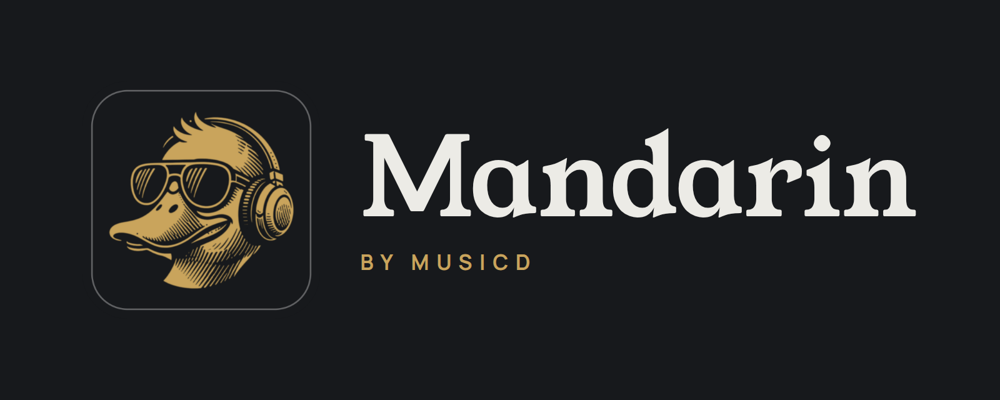

<div align="center">

<picture>
  <source media="(prefers-color-scheme: light)" srcset="docs/mandarin-logo-light.png">
  
</picture>

</div>

# Mandarin — v0.6.3

**Your own music files, played to Sonos rooms, to UPnP/DLNA renderers — a WiiM, a Chord Poly,
a streamer, an AV receiver — and to the Mandarin app, designed for this server.**

A small server on a machine you own scans your music folders. Every player in the house plays
from it, controlled from a browser, an iPhone home-screen app, or the native Android app. No
subscriptions, no streaming accounts, nothing of yours leaves the house.

```
 browser / iPhone PWA / Android app ──HTTP──▶  Mandarin  ──Sonos UPnP──▶  Sonos rooms
                                                   │      ──UPnP AV / DLNA──▶  WiiM, Chord Poly, receivers, TVs
                                                   │      ──HTTP──▶  the Android app (phone, USB DAC)
                                                   └──── audio: /stream/… ◀────────┘
```

---

## What it does

* **Home** — Random Album and the Album of the day under the greeting, then Not played in six
  months, Listen later, Playlists, Favourites, Recently played, Smart Picks, Label of the week,
  Random albums, the Library and genres. Reorder the rows or switch them off.
* **Album of the day** — the same album on every device, chosen by the server at 00:01; once
  played, from anywhere, it's gone until the next 00:01.
* **Library** — sort by title, artist, year, date added, plays or last played; focus by genre,
  decade, format, sample rate, bit depth, label, starts-with and date added. A Random albums wall
  turns over each visit.
* **Music folders** — any number of folders the server can see, added and removed in Settings,
  watched so new and deleted albums show up by themselves.
* **Search** — albums, artists and labels as you type. Typo-tolerant, any word order.
* **Album pages** — tracks, year, label, write-ups from Wikipedia and Qobuz's editorial pages,
  the Pitchfork score, favourite, listen later, download, share. Previous and next, or a swipe,
  step through the albums of the row or wall you came from.
* **Pitchfork** — the latest reviews and Best New Music to read in the app, with Play on any
  record you own.
* **Edit album** — correct the title, artist or year and find a cover. Edits live in the
  database; your files stay exactly as they are.
* **Every tag kept** — all of each file's tags and identifiers are read into the server's
  database, and used to identify albums.
* **Library Scanner** — albums identified by their files' identifiers first, then MusicBrainz by
  tracks and lengths, with iTunes as a second opinion; ReplayGain measured for untagged files.
* **Volume Levelling** — ReplayGain per device: Track, Album or Auto, a target from −14 to −25
  LUFS, peaks respected. On every kind of device, the phone included.
* **Now playing** — a waveform seek bar drawn from the audio, the queue, history, and a badge
  saying what the device is being sent.
* **Share card** — the record as an image, where to hear it, where to read about it, and three
  acts worth hearing next.
* **Wall display** — a full-screen now-playing page at `/display` for a TV or tablet.
* **Random Album Radio** — when a device's queue runs out, another whole album you haven't heard
  lately goes on. Per device.
* **Smart Picks and Discover** — five records a day from your own library, by acts near the ones
  you play; new releases by the artists you listen to.
* **Playlists** — ones you make, Dynamic Playlists that follow a saved Library view, and sharing
  and importing as a playlist file you can pass on.
* **Favourites** — a heart on any album, gathered on a Home row of their own.
* **Listen later** — albums put aside to hear, on a Home row and a wall of their own. Each comes
  off by itself once every track has played.
* **Label of the week** — with Record labels on, one label from your library on Home all week,
  with its albums; a new one each Monday.
* **Record labels** — from the files' tags or a folder level: a Labels screen, logos from Discogs
  and FanArt.tv, lookups for untagged albums, merging of duplicates.
* **Sonos** — play, queue, play next, shuffle, repeat, volume per speaker, and move what's
  playing to another room, renderer or phone. Sonos rooms group and ungroup here too; Sonos keeps them in step.
* **UPnP/DLNA renderers** — a WiiM, a Chord Poly, a streamer, an AV receiver, a TV: gapless,
  with volume, radio and everything a Sonos room has; DSD sent as DSD where taken.
* **Audio Devices** — every player with what it takes (rates, depths, formats), a name of your
  own, a switch each, and Original or Upsample ×2, ×4 or Max output.
* **DSP** — a parametric EQ of up to ten bands per renderer or phone, the curve drawn as you
  edit, plus headphone profiles from AutoEq or a pasted ParametricEQ.txt.
* **The Android app** — the same interface plus lock-screen controls, volume keys, a widget, a
  Quick Settings tile, a share sheet, Android Auto, and updates of its own.
* **This phone** — the phone is a room of its own: speaker, headphones or Bluetooth, with the
  queue, history and radio like any other. At home your other devices can play to it too, under
  its own name, while the app is running on it.
* **USB DAC on the phone** — the app's own USB Audio driver feeds a DAC on the phone's port at
  the file's rate and depth, DSD natively or as DoP, Android's mixer out of the way. The DAC's
  volume starts low, with a limit, or fixed for a DAC without its own control.
* **Downloads** — albums kept on the phone, in a folder you choose, as the files themselves or
  as Opus 256, played with no server at all; today's picks kept automatically if you like.
* **Music on this phone** — a folder of files already on the phone, watched for changes, shown
  and played like the library.
* **Offline mode** — one switch in the menu: only the music on the phone shows, and the server
  isn't used. With no connection the app does the same by itself, and reconnects on its own.
* **Away from home** — on mobile data the app reaches the server over its built-in Tailscale.
  Tracks come as Opus 256; only the phone plays.
* **One account** — a username and password kept on the server, SRP sign-in, every device listed
  under Settings → Account.
* **Updates** — the server updates itself from GitHub from Settings; the app offers each new
  version when it opens.

## New since the last beta (v0.5.50)

* **Multi-disc albums** — A two-disc symbol on the cover in every grid for an album of several discs, from disc folders or disc numbers.
* **Random Album** — The first tile under Home's greeting, a brass disc turning in its middle: one tap plays a whole album you haven't heard lately.
* **Album of the day, kept by the server** — One album for every device, chosen by the server at 00:01 and remembered through updates and restarts; once played, from anywhere, it's gone until the next 00:01.
* **Not played in six months** — Hidden until Mandarin has six months of your listening, then offers the albums you haven't heard since.
* **Now playing goes back** — Opened over an album, its corner button returns to that album. On large screens it can shrink to a card and be dragged.
* **API keys checked** — The Discogs and FanArt.tv boxes show a ✓ when the service accepts the key, or ✕ when it refuses it.
* **Untagged albums named from folders** — A file with no tags takes its artist, album, year, title and track from its folder and file names, then is identified on MusicBrainz; nothing is written to the files.
* **One album per folder** — Two copies of a record in separate folders are two albums; disc folders such as Disc 1 or CD2 inside an album's folder are one album, shown disc by disc.
* **Every tag kept** — All of each file's tags and identifiers — MusicBrainz IDs, barcode, catalogue number, ISRC, ReplayGain — read into the server's database.
* **Library Scanner** — Albums identified by what their files carry first, then by MusicBrainz and iTunes; ReplayGain measured for files without it. Under Music Folders in Settings.
* **Volume Levelling** — ReplayGain set per device — Off, Track, Album or Auto — with a target from −14 to −25 LUFS and a level for tracks of unknown loudness.
* **DSD to renderers** — A renderer that takes DSD files, such as a Chord Poly, is sent the DSF or DFF itself, at the DSD rates switched on for it.
* **Move to another device** — Moving what's playing to another room, renderer or phone carries the queue over and plays on from the same track and second.
* **Play to another phone** — A phone running the app is a player for your other devices at home, under its own name, while the app runs.
* **Offline mode** — One switch: only the music on the phone shows and the server isn't asked. The app also opens with no signal and finds the server again by itself.
* **Share card saved** — In the app, Download saves the card to the phone's Pictures/Mandarin.
* **Help behind ⓘ** — Every setting's longer explanation opens from an ⓘ after its name, with a short line left under it.
* **Release candidates** — The app, its update check and the server's updater read 0.6.0-RC builds in order, so updates arrive one after another.

## What each device is sent

Each track goes the way the device can take it. The Now playing badge says what was sent.

* **Sonos** plays up to 24-bit / 48 kHz. Within that, the file as stored. Above it, or in a
  format Sonos can't read, FLAC at 24/48.
* **A UPnP/DLNA renderer** has its own ceiling, read from the device. Within it, the file as
  stored; above it, FLAC at the best rate the device takes in the file's family; upsampled
  ×2, ×4 or to the device's maximum if you choose. DSD goes as the DSF or DFF file itself to a
  device that says it takes DSD files (DSD rates switchable on its page), as PCM otherwise.
* **The Android app** on the phone's own output: the file as stored within 24/48, FLAC 24/48
  above it; Opus 256 away from home.
* **A USB DAC on the phone**, with USB direct on: the file at its own rate and depth where the
  DAC takes it, DSD natively or as DoP, FLAC at the DAC's best rate otherwise.
* **Formats nothing plays as they are** — APE, WavPack, WMA Lossless, 24-bit WAV, more than two
  channels — become FLAC, in stereo.

Conversion is ffmpeg with the SoX resampler and triangular dither. A converted track is written
to a cache as it plays, so the device starts on the first frames, and the next tracks in the
queue are prepared ahead. Replays come from the cache (4 GB by default, least recently played
removed first).

## Install (Docker)

Run it on an always-on Linux machine on the same network as your speakers — a NAS, a
Raspberry Pi 4/5 (64-bit OS), a home server.

If Docker isn't installed yet:

```bash
dietpi-software install 162              # DietPi (162 is its Docker package)
curl -fsSL https://get.docker.com | sh   # Debian, Ubuntu, Raspberry Pi OS
```

Then:

```bash
docker stop musicd-server 2>/dev/null; docker rm musicd-server 2>/dev/null
docker pull ghcr.io/meltface-80/musicd-server:latest

docker run -d \
  --name musicd-server \
  --network host \
  --restart unless-stopped \
  -e TZ=Europe/London \
  -v musicd-server-data:/app/data \
  -v /your/path/to/Music:/music:ro \
  -v /mnt:/mnt:ro,rslave \
  ghcr.io/meltface-80/musicd-server:latest
```

Open **`http://<server-ip>:3500`**. The first scan runs straight away; a big library takes a
few minutes and albums appear as it goes.

> **`--network host` is required.** Sonos players are found by multicast, which does not
> cross Docker's default bridge network — and the speakers fetch audio from this machine's
> own address. Docker Desktop on macOS/Windows has no real host networking, so this needs a
> Linux host.

> **Keep the `musicd-server-data` volume.** It holds the library database, play history,
> playlists, settings and the artwork and transcode caches. Point every future `docker run`
> at the same name.

**Music folders, chosen in the app.** Mount your drives or shares into the
container once — e.g. `-v /mnt:/mnt:ro,rslave` — then add any folders inside them in
**Settings → Music Folders**, as many as you like, and remove them there too. The folder
picker lists every drive and share the server can see.

> **DietPi (and any network share mounted on demand):** DietPi-Drive_Manager mounts USB
> drives and network shares under `/mnt`, and mounts shares only when they're first opened.
> A container started with a plain `-v /mnt:/mnt:ro` never sees those later mounts — the
> folder looks empty. End the line with **`,rslave`** (`-v /mnt:/mnt:ro,rslave`) so mounts the
> machine makes afterwards reach the server too, then re-create the container. Music Folders
> says so when it spots a share it can't see. `/music` is
the first folder until you change the list. A folder that goes missing for a while (a drive
asleep, a share that dropped, part of it unreadable, most of it gone at once) keeps its
albums; the page says so and offers to forget it.

A `docker-compose.yml` is in the repository: set your music path and `docker compose up -d`.

### Build it yourself instead

```bash
git clone https://github.com/meltface-80/Mandarin.git
cd Mandarin
docker build -t musicd-server:local .
# then the docker run above, with musicd-server:local as the image
```

### Updating

**In the app:** Settings → **Updates** → **Check for updates** → **Update to vX.Y.Z**. The server
downloads the new release from GitHub, swaps it in and restarts itself in a few seconds;
the page reloads on its own. It also checks twice a day and shows a banner when a new
version is out. (From v0.1.3 on — an older container needs one update the manual way.)

**Manually** — also the way to pick up changes to the image itself (ffmpeg, Node):

```bash
docker pull ghcr.io/meltface-80/musicd-server:latest
docker stop musicd-server && docker rm musicd-server
# re-run the docker run command above — the data volume carries everything over
```

## Configuration

Everything is optional; pass any of it with `-e NAME=value`.

| Variable | Default | Purpose |
| --- | --- | --- |
| `PORT` | `3500` | The web interface, the API, and where speakers fetch audio. |
| `TZ` | UTC | Your time zone — Album of the day changes over at 00:01 and Smart Picks at local midnight. |
| `SONOS_HOSTS` | — | A speaker's IP (comma-separated for several), for when multicast discovery is unreliable. One is enough. |
| `UPNP_HOSTS` | — | UPnP/DLNA renderers to ask by address (an IP, or a description URL like `http://192.168.1.50:49152/description.xml`), for when multicast discovery misses them. |
| `SERVER_IP` | auto | The address speakers should fetch audio from, for hosts with several network interfaces. |
| `INCLUDE_ZONES` | — | Offer only these rooms, e.g. `Kitchen,Study`. |
| `EXCLUDE_ZONES` | — | Offer every room except these. |
| `SCAN_INTERVAL_HOURS` | `6` | How often the music folders are re-checked in full (only changed files are re-read). Changes are also noticed as they happen through the file system's own notifications, where it gives them — a network share changed from another machine waits for this. Rescan any time from the menu. |
| `TRANSCODE_CACHE_GB` | `4` | Disk kept for converted tracks. An upsampled track is several times a CD-rate one: with upsampling on, 16 is a better number. |
| `TRANSCODE_CONCURRENCY` | `2` | How many tracks are converted at once. |
| `MUSIC_DIR` | `/music` | Where the library is mounted inside the container. |
| `TS_AUTHKEY` | — | Sign the server's built-in Tailscale in with an auth key instead of from *Settings → Away from home*. |
| `TS_HOSTNAME` | `musicd` | The server's name on your tailnet. |
| `TAILSCALE` | on | `off` leaves the built-in Tailscale out (Tailscale on the host still works). |
| `TAILSCALE_ADDRESS` | auto | The server's address away from home, if the one found on the host's `tailscale0` isn't the one to use — an IP, a MagicDNS name, or a full `https://` address. See [Away from home](#away-from-home-tailscale). |
| `MUSICBRAINZ_URL` | musicbrainz.org | Another MusicBrainz web service (a mirror) for the identification scan and release days. |
| `IDENTIFY` | on | `0` leaves the identification scan out entirely. |
| `ITUNES_COUNTRY` | US | The Apple store the identification scan's iTunes lookups use (`GB`, `DE`…). |
| `AUTOEQ_URL` | GitHub | Where AutoEq's results are read from for headphone profiles (Settings → Audio Devices → a device → DSP). |
| `DEBUG` | — | Log every API call. |

Settings for the FanArt.tv key (wall-display artist photos), waveform, share-card services, Smart Picks, Discover,
the wall display and the Home rows are in the app's Settings and are saved in the data volume.

## Your account

Mandarin has **one account**, kept on the server itself — nothing online. Until it
exists the server does nothing but ask for it:

1. Open `http://<server-ip>:3500` on a device **on your home network** (a browser, the iPhone
   home-screen app, or the Android app) and choose a username and password.
2. Every other device signs in with them once and is remembered.
3. **Settings → Account** lists every signed-in device, with a *Sign out* button for each, and
   changes the password.

The password never crosses the network, even on plain http: devices prove they know it with
SRP (the scheme Apple uses for HomeKit pairing), and the server proves it knows the account
back. The server stores only an SRP verifier, never the password.

**Forgot the password?** On the server run

```bash
docker exec musicd-server node reset-password.js
```

It removes the account and signs every device out; your library, edits, playlists and history
stay. Then create the account again from a device at home.

Sonos speakers can't sign in: the addresses they're given carry a signature, and the speakers'
own addresses are let through, so playback is unaffected.

## iPhone and iPad

Open `http://<server-ip>:3500` in Safari, tap **Share → Add to Home Screen**. It opens full
screen like an app, with the same interface as the Android app.

## Android

A bespoke native app, designed from the ground up for the Mandarin server:
**[android/](android/)**. Enter the port (3500 unless you changed it) and it
finds the server on your Wi-Fi by itself — or type the address — then signs in (or creates the
account on a new server) right in the app, no other device needed. It shows the server's own
interface, and adds what a web page can't:

* **Lock screen and notification controls**, which headset and Bluetooth buttons also reach
* The phone's **volume keys** move the room's volume
* A **home-screen widget** — now playing, transport, and a tap on the cover for a random album
* A **Quick Settings tile** — a random album without opening anything
* A proper **share sheet** for the share card
* **This phone** — the phone itself is one of the rooms. Pick *This phone* in the room picker
  and albums play through its speaker or headphones, with the queue, now playing, history and
  Random Album Radio working as for any Sonos room, and *move what's playing* works between the
  phone and any Sonos room. It's the Android app's own: only that phone sees it (the iPhone
  home-screen app and browsers don't). It's there while the app is open or playing.
* **Downloads** — on an album's page, *⋯ → Download to this phone*, as **Original** (the files
  as they are; formats a phone can't play become lossless FLAC) or **Opus 256** (about a quarter
  of a CD-quality FLAC's size). Saved to phone storage or an SD card, Wi-Fi only by default, with an optional
  size limit — all under *Settings → Downloads*. Downloaded albums play with no
  server at all (the same screen, or *Play downloads* when the server can't be reached), a
  downloaded track is used instead of streaming it, and plays made offline join your history
  when the phone is back. Downloads live in the app's own storage, so uninstalling the app
  removes them (updates don't). A **Downloaded albums** row heads the Home screen once something is
  downloaded (and stays while anything is).

* **Away from home** — off your Wi-Fi the app carries on over Tailscale, as a player for the
  phone only. See below.
* **Automatic downloads** — today's Smart Picks, the Album of the day and the newest albums kept
  on the phone by themselves (Downloads screen), and removed again when they drop off the list.
* **Android Auto** — Downloaded albums, Smart Picks and Random albums in the car. Android Auto
  lists a sideloaded app only with *Unknown sources* on in its developer settings (tap the
  version number in Android Auto's settings ten times to reach them).
* **Updates itself** — the app offers each new version when it opens (or *Settings → Updates →
  Check for app update*) and installs it over the top; Android asks once to allow it.
* **USB DAC** — plug a DAC into the phone's port and it appears on *This phone*'s page in Audio
  Devices with what it takes. **USB direct** plays through the app's own USB Audio driver: the
  file at its own rate and depth, DSD natively or as DoP, Android's mixer out of the way. A DAC
  with its own volume control starts low and follows the slider and the volume buttons; the
  rest are driven at full for the amplifier to set, with a volume limit if you want one.

**Download: [mandarin-android.apk](https://github.com/meltface-80/Mandarin/raw/main/dist/mandarin-android.apk)**
— the newest build, published by GitHub Actions on every version merged to `main`. Sideload it
on Android 8.0 or newer.

**Updates install over the top** from v0.2.1 on: every build is signed with the same key
(`android/app/musicd-debug.keystore`). Builds before v0.2.1 were each signed with a different
key, so going from one of those to v0.2.1 needs **one** uninstall first — after that, never again.

That key is a debug key committed to this public repository, so it only keeps your own updates
working. For a key nobody else holds, add the `MUSICD_KEYSTORE_BASE64` and
`MUSICD_KEYSTORE_PASSWORD` secrets (the same ones as Android Random Remote); switching to it
also needs one uninstall.

## Favourites

Every album's page has a heart, first in its row of buttons: hollow, red once tapped. Hearted
albums are a **Favourites** carousel on Home (newest first; tap its title for the full wall),
kept on the server by the album's identity, so they survive a rescan.

## Record labels

Off by default; Settings → Record labels switches it on. Each album's label is its files'
LABEL (or PUBLISHER) tag — read with the library, nothing looked up — with the company words
and country folded away, so "Blue Note Records (UK)" and "BLUE NOTE" are one label, *Blue
Note*. On: a **Labels** screen in the side menu (every label and its albums, alphabetical or
shuffled), the label on the album page and the share card (tap it for the label's albums),
labels among the search results, a *Record label* facet in Library Focus, and a **Label of the
week** row on Home: one label with three albums or more, the same one all week. The Settings
page says how many albums carry a label tag and how many don't. A library filed by label
(`/music/Jazz/Blue Note/Album`) can take the label from the folder at a set depth instead.

Two names the files keep apart can be **merged**: hold a tile on the Labels screen, select
the rest, Merge folds them into the first; the tile says "N merged", and tapping that undoes
one at a time. **Logos** are found in the background for every label without one — Discogs
first (your Discogs token, Settings → API Keys), then FanArt.tv by the label's MusicBrainz id
(your FanArt.tv key) — kept in the data folder and served like covers, so the app caches
them. The picture button on a label's page offers Discogs' candidates or takes a pasted
address. A label no source has a logo for is asked about again after a week, or at once
with Force rescan.

An album whose files carry no label tag gets one **looked up**, in the background:
MusicBrainz first (a release by that title and artist, and its label), then Discogs with your
token. What's found is kept by the album's identity, so a library rebuild keeps it; a miss is
asked about again after a month, or at once with Force rescan. The files' own tag always
wins, and the scan log (on the Labels screen) says what each lookup found.

## Library Scanner

Some albums arrive with the wrong artist — a compilation's "Various Artists" on a record that
isn't one, a blank, a typo — or with track titles like `Track 01`. Settings → **Library
Scanner** (under Music Folders) holds **Identify albums**, a scan that finds each album's right names on
[MusicBrainz](https://musicbrainz.org) (no key: the app names itself and asks at most once a
second) from what the files already say: the title, the track count, the artist where the tag
can be trusted, and each track's title and **length** — twelve tracks that match a release to
the second are that release, whatever the artist tag claims.

**What the files carry comes first.** The scanner reads every tag in every file into the
database, and an album whose files name their release is matched by that before any search by
name: a **MusicBrainz release ID** (as Picard writes it) is taken as it is; a **barcode** (UPC/EAN)
finds the releases carrying it, and a **catalogue number** with its label the same; failing
those, a few of the tracks' **ISRCs** find the releases those recordings share. A release found
this way is applied when its tracks fit, and the Applied list says what matched it ("matched by
barcode"). A barcode is asked of iTunes too, for what MusicBrainz doesn't know.

**Files with no tags** are named from where they're filed: the artist from the folder above the
album's (`808 State/10x10 (1993)`) or an `Artist - Album` folder, the album and year from the
album's folder, and the title, track and disc from the file name (`1-01 - Pacific State`). Only
what the tags leave empty is filled; folders such as `Music` or `4tb` are never taken for an
artist, and nothing is written to the files. Those albums are then looked up like any other, and
their page says the names come from their folders until a match or an edit replaces them.

Each candidate release is scored the way [beets](https://beets.io) does it, and named by its
release group: the album is the MusicBrainz *release group*, the copy you have is one *release* of
it, so "Kid A (2015 Remaster)" tagged 2015 becomes **Kid A, 2000**, with the pressing noted
beside it, and track titles lose their remaster tails. At **95 % alike or better** the match
is applied — artist, title, year and track titles — to the same database overlay the album
editor writes, so the files are never touched and a rescan changes nothing.
What counts most is the track count and the lengths, then the track names (what's in
brackets set aside, so "Live For (Album Version (Explicit))" is "Live For"), then the album's
name and artist, and the year least; a release labelled live or remix when your files don't
say so costs a little. Nothing else holds a match back — two releases that fit equally, or one MusicBrainz has
without track lengths, are applied too, and Undo puts back the odd wrong one. Names are
compared as spellings of the same word: "&", "+" and "and", "Kickin'" and "Kicking".
A near miss is **proposed** on the page (Accept or Reject), saying what it's short of — the
track lengths, a name, the year; anything further off is left **unidentified** for you: tap it, then
⋯ → Edit album — or tap **Barcode…** and type the digits off the sleeve, or paste the
release's musicbrainz.org address, and that release is applied. Applied names have **Undo**.
Albums you edited by hand are never touched.

An album MusicBrainz can't place is looked up in **Apple's iTunes catalogue** too (no account
or key; a request every 3.2 seconds, well inside what Apple allows). What iTunes finds is
applied by the same rule — 95 % alike or better — and proposed when it's near. Apple's release date is often a reissue's, so an
album matched this way keeps the year its files carry. **Ask iTunes too** on the same page
switches it off; `ITUNES_COUNTRY` picks Apple's store (US by default).

**Scheduling** is on by default: the scan runs between the start and end times you set each
night (01:00–06:00 to begin with, on the server's clock). Off, it runs whenever the library
isn't being scanned, about twelve albums a minute, until every album has been looked at; new
albums are checked as they arrive. The design is in
[docs/specs/album-identification.md](docs/specs/album-identification.md).

## Volume Levelling

Each device has its own **Volume levelling** (Settings → Audio Devices → the device, above DSP):
Off, **Track** (each track at the same level), **Album** (each record at the same level, its quiet
and loud songs as they were made) or **Auto** — Album while a record plays in order, Track when
tracks from different records follow one another: a shuffle, a playlist, radio. With it on, two
more settings show:

* **Target volume level** — −14 LUFS (the default) down to −25 LUFS.
* **Volume adjustment when loudness is unknown** — 0 to −12 dB (−5 by default), for a track with
  no ReplayGain tags that hasn't been measured.

The gains are the files' own ReplayGain tags (`REPLAYGAIN_TRACK_GAIN`, `REPLAYGAIN_ALBUM_GAIN` and
their peaks, or Opus's R128 gains); a track's peak caps its gain so it is never turned up into
clipping. On Sonos rooms and UPnP/DLNA renderers the gain goes into the stream: the track is sent
as FLAC at its own rate with the gain applied. The Android app applies its own setting itself, to
streams and downloads alike. A change is heard straight away, from where the music is.

**Measure ReplayGain** (Settings → Library Scanner) fills in files without ReplayGain tags: the
server measures each one (EBU R128 integrated loudness and true peak, with ffmpeg) one file at a
time in the background, and works out an album's gain once all of its tracks are known. The files
are never changed.

Every setting's longer explanation sits behind the ⓘ after its name.

## Audio Devices

Settings → **Audio Devices** lists every player Mandarin can see: your Sonos rooms, phones
running the app, and UPnP/DLNA renderers found on the network — a WiiM, a Chord Poly, a
streamer, a receiver, a TV. Tap one for what it is and what it can take (sample rates, bit
depths, formats) and to give it a name of your own, which is what the zone picker and Now
playing then show. The name lives in Mandarin's database; the Sonos app keeps its own.

A renderer's rates come in layers, and each chip says which: what the device advertises, what
is known for its model (the WiiM range, the Chord Poly), what you tick, and what it was seen
to play. Sonos rooms are read-only here (44.1/48 kHz, 16/24-bit — the 24/48 rule). The network
is searched every minute; **Look again** searches now, and `UPNP_HOSTS` names renderers that
multicast misses.

Away from home, the Mandarin app sees the phone it is on here and nothing else: the one
player there is away, with its own settings. The rooms, the streamers and the network search
are for home.

**DSP** (a renderer's page): a switch and a parametric EQ of up to ten bands — peak, shelves,
pass filters — with the response drawn as you edit. On, every track is decoded to 64-bit
float, the headroom taken (automatic: half a dB under the bands' combined peak, or set by
hand), upsampled if Output says so, the bands run in double precision, then dithered once to
24 bits (32 where the device takes it). Off, the file goes as stored. Sonos rooms are tuned
with Trueplay and have no DSP here. A phone running the Mandarin app has the same page: its bands run in the app, on everything
the phone plays, through Bluetooth, USB or the speaker. Either page also takes a **headphone profile**: pick a headphone by name from AutoEq (the index
is fetched once a day and the profile kept once chosen) or paste a ParametricEQ.txt, and its
bands run before the PEQ's, under the profile's own preamp where that covers the peak.

**Music on this phone** (the Android app): Settings → Music Folders → On this phone takes a
folder of your choosing — purchases waiting to go to the server. The app reads its tags and
covers, shows the albums on Home as *Music on device*, and plays them on the phone through its
DSP. The folder is watched: music added or taken away shows up or goes by itself. The server
never sees these files. Downloads have a folder of their own: Settings → Downloads → Download
folder (Android asks for all-files access once); downloads saved there outlive the app — a
fresh install pointed at the same folder finds them again. *Move all here* carries existing
downloads over.

**Listen later**: on an album, *⋯ → Listen later* (or select several on a wall) puts it aside; a
Home row and a wall list them, newest first, and an album comes off once every track has been
played since, or by hand.

**Each device has a switch.** A renderer found on the network is **off until you turn it on** —
nothing new appears in the zone picker by itself; a Sonos room is on until you turn it off. The
switch is on the device's row and on its page, and its state is kept in Mandarin's database.

**Random album radio is per device.** Its switch is on each device's page: when that
device's queue ends, whole random albums keep coming (ones you haven't played in two months).

**A renderer is a zone.** Turn it on, pick it in the zone picker and everything a Sonos room has works
on it: the queue, play next, the transport, seek, volume and mute (unless the device's volume
is fixed, as a Chord Poly's is — then there is no slider), history, Random album radio, and
moving what is playing between it and a room. The server keeps its queue and hands each track
over ahead of time (`SetNextAVTransportURI`), so tracks join gaplessly on a device that
honours it; one that does not is started on the next track by hand. In **Original** mode a
file goes as stored wherever the device takes its rate, depth and format — the chips on its
page — and above that ceiling as FLAC at the highest rate the device takes in the file's
family (a 352.8 kHz file plays at 176.4 on a WiiM). The Now playing badge says exactly what
was sent: *FLAC 24/96*.

**Upsampling.** A renderer's page has an Output section: Original, Upsample ×2, ×4 or Max —
in the file's family (44.1 → 88.2 → 176.4; 48 → 96 → 192), capped at the device's ceiling,
processed in 64-bit float and sent at 24 bits, or 32 where the device takes it and the
server's ffmpeg writes 32-bit FLAC. On a WiiM, what the decoder is really running is read back
through its own API; when it matches, the rate gets its ✓ and the badge reads *FLAC 24/176.4 ↑×4 ✓*.
The plan for the rest is [docs/specs/audio-devices-upnp.md](docs/specs/audio-devices-upnp.md).
The next stages (the phone in Audio Devices away from home, the mobile-data stream, DSP
with AutoEQ and PEQ, music on the phone, SD-card downloads, Listen later, record labels) are
planned in [docs/specs/roadmap-stages.md](docs/specs/roadmap-stages.md).

## Away from home (Tailscale)

Leave the house and the Android app keeps working over mobile data: the phone is
the only thing it plays to. No ports are opened on your router — the phone reaches the server
over [Tailscale](https://tailscale.com), a private network between your own devices.

**Away, only the phone plays.** Whatever reaches the server from outside your home network —
Tailscale included — is offered one room: the phone asking, as *This phone*. The Sonos rooms
aren't listed, and nothing away can play to them, pause, group or mute them, or reach another
phone. The server decides this by where each request comes from, so it holds for any device:
an iPhone or a laptop on Tailscale can browse the library but has nothing to play to. At home
everything is as before. Away, tracks stream as **Opus 256 kbps** (about a quarter of a CD-quality FLAC's data), made
through a 64-bit float resample to Opus's 48 kHz and decoded on the phone to float by the app's
own libopus — 24/48 into the phone's audio path, no 16-bit step; albums you've downloaded play
from the phone.

**Set up once — Tailscale is built in:**

1. On the server, open *Settings → Away from home* and tap **Sign in to Tailscale**. Sign in on
   Tailscale's page (a free account is enough). The server joins your tailnet by itself as
   **musicd** — no Tailscale to install on the machine it runs on, no VPN, no ports opened. For a
   server with no one at it, pass an auth key instead: `-e TS_AUTHKEY=tskey-auth-…`.
2. On the phone, sign Mandarin's app in to the same account: *Settings → Away from home → This phone*. The
   app carries its own Tailscale too — no Tailscale app needed.
3. Open Mandarin once at home: the app learns the server's tailnet address.

From then on the app follows the phone's network: on your Wi-Fi it uses the server's home
address; on mobile data (or anyone else's Wi-Fi) it goes over its own Tailscale connection, and
the page, the queue and the music carry on without a reload. Anything else signed in to your
tailnet — an iPhone with the Tailscale app, a laptop — opens the address *Away from home* shows.

The server's Tailscale keeps its identity in the data volume, so a new container is the same
machine. `TAILSCALE=off` leaves it out; `TS_HOSTNAME` names it something other than *musicd*.
Tailscale installed on the host still works as before (the server uses its own first when both
are there, or `TAILSCALE_ADDRESS` to say which).

Don't advertise your home subnet from the server's Tailscale (`--advertise-routes`): requests
through a subnet router arrive from a home address, and the server can't tell they're away.

## How it works

* **Library.** The music folder is walked and every audio file's tags are read with
  music-metadata into SQLite. Albums are decided a folder at a time, so a folder of tracks by
  different artists with no album-artist tag becomes one compilation, and `CD1`/`CD2` folders
  become one album. Covers come from `cover.jpg`/`folder.jpg`/… or the first track's embedded
  picture, resized once per size and cached. Rescans only re-read files whose size or date changed.
* **Renderers.** `lib/renderers/` finds UPnP/DLNA renderers by SSDP, reads each one's
  description and what it advertises it can play (plus a WiiM's own API), keeps a register
  of every device with your names and settings, and plays to them through AVTransport —
  the queue kept on the server, the next track handed over ahead of time for gapless
  playback, changes arriving by UPnP events. `plan(track, target)` in `lib/stream.js` decides
  what each device gets: the file itself within its ceiling, FLAC at its best rate or
  upsampled in 64-bit float otherwise.
* **Sonos.** Ported from [Caldera Sonos Bridge](https://github.com/meltface-80/Caldera-Sonos-Bridge)
  and the [UPnP to Sonos bridge](https://github.com/meltface-80/UPnP-to-Sonos-UPnP-bridge): one
  speaker is found over SSDP and the whole household is read from `ZoneGroupTopology`. A Sonos
  *group* is a zone (its coordinator owns the queue) and each *room* is an output (volume and
  mute are per room). Tracks go into the coordinator's own **Sonos queue**, with the DIDL-Lite
  metadata Sonos insists on, so playback is gapless and the speaker moves between tracks by
  itself. The queue you see is read back from the speaker, so anything added from the Sonos
  app appears too.
* **Audio.** Each queued item is a URL on this server. Within 24/48 it serves the file as
  stored, with byte ranges; above that, ffmpeg writes FLAC 24/48 to the cache and the speaker
  is served from the growing file.
* **Interface.** Mandarin's own page in `public/`, served by the server and shown in the browser,
  the iPhone home-screen app and the Android app alike, talking to the server's `/api`.

## Troubleshooting

* **No rooms.** `http://<server>:3500/api/status` shows what discovery found (`sonos.rooms`,
  `sonos.error`). Check host networking, or set `SONOS_HOSTS` to one speaker's IP.
* **A room plays nothing / skips every track.** The speakers must be able to reach the server
  on its port. On a host with several interfaces set `SERVER_IP` to the LAN address.
* **No albums.** `/api/status` shows `music_dir` and `index_count`. Check the `/music` mount
  and that the container can read it.
* **Hi-res tracks don't play.** `http://<server>:3500/api/health` must say `"ffmpeg": true`.

## Development

```bash
npm install
npm test            # unit tests + end-to-end runs against a fake Sonos household and fake UPnP renderers
MUSIC_DIR=~/Music PORT=3500 node index.js
```

The end-to-end test starts two fake Sonos rooms on 127.0.0.11/12:1400, plays a CD-quality
album and a 24/96 album through the real server, and checks what the "speaker" fetched:
bit-perfect FLAC for the first, FLAC 24/48 for the second. It needs ffmpeg on the PATH
(or `FFMPEG_PATH`).

The browser test opens the page itself in headless Chromium or Chrome — at a desktop with a
mouse, a phone and a tablet — and checks Home, the album view and Now playing. It uses the
browser already installed (or `CHROME_PATH`), with no extra packages, and is skipped where
there is none.

## License

MIT. The Sonos control is ported from Caldera Sonos Bridge and the UPnP to Sonos bridge, by the
same author.
